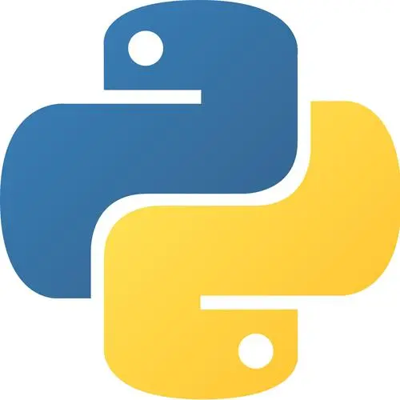
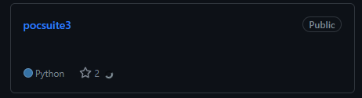

## 渗透测试工程师—pontusec

热爱生活、热爱技术。工作经验3年。喜欢参与一些开源项目的讨论。

### **社交主页：**
      
<a href="https://pontusec.github.io/"><code></code></a>：优秀作者，发表了 30 篇技术文章，15万阅读。    
### **技术栈:**
<a href="https://www.python.org/"><code></code></a>     
<a href="https://v3.cn.vuejs.org"><code></code></a>    
<a href="https://reactjs.org/"><code></code></a>  
<a href="https://www.tslang.cn/index.html"><code></code></a> 
<a href="https://webpack.js.org/"><code></code></a>
<a href="https://cn.vitejs.dev"><code></code></a>   
<a href="https://sass-lang.com"><code></code></a>
<a href="https://tailwindcss.com"><code></code></a>  
<a href="https://go.dev/"><code></code></a> 
<a href="https://www.docker.com"><code></code></a>  
### 开源项目
 -   <a href="https://pontusec.github.io/"><code></code></a>     
### Github 活跃度
   
 

 
 
